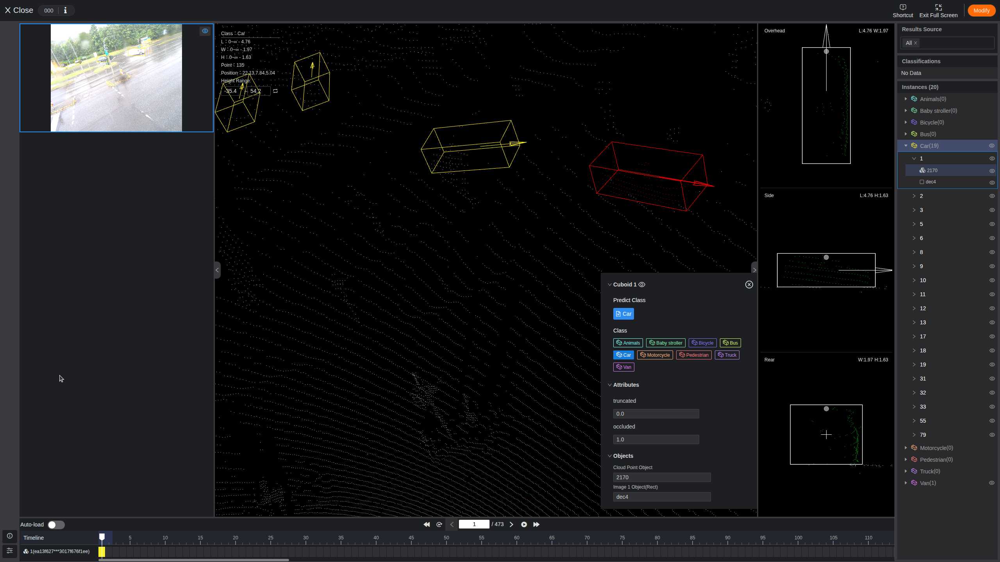

# Conversion of OpenLABEL json files to Xtreme1 json files

OpenLABEL is an open standard from ASAM that defines the annotation format and labeling methods for objects and scenarios in autonomous driving and robotics. 

It provides:
- A flexible JSON schema for 2D/3D bounding boxes, segmentation, skeletons, and attributes (e.g., occlusion, truncation).
- A common structure for multi-sensor data (camera, LiDAR, radar, etc.), ensuring interoperability across tools.
- Support for scenario tagging and relationships between objects, making it possible to capture complex driving scenes consistently.

In my case, it is used for multi-sensor data labeling (camera and LiDAR). These files include information about 2D and 3D bounding boxes, as well as attributes such as occlusion and truncation.

Currently, OpenLABEL JSON files cannot be opened directly in any annotation tool to verify the values inside them. To address this, I came up with the idea of converting these files for visualization in Xtreme1, along with the corresponding camera images and LiDAR point clouds.

---
## Conversion process:
### Prerequisite
Install Xtreme1 tool from [https://github.com/xtreme1-io/xtreme1](https://github.com/xtreme1-io/xtreme1?tab=readme-ov-file#install)

### Ontology
Below process has to be followed to get the latest class IDs of all the classes and their atttributes from Xtreme1:
1. Create a folder in PC with following structure and zip it (have same number of files i.e. 1 or 2 in each folder). Refer the [example scene_0_test.zip](https://github.com/surendrakoganti/OpenLABEL_to_Xtreme1/blob/main/scene_0_test.zip) for clear understanding.
   * camera_config : consists camera's intrinsic and extrinsic calibration in json file for each image (this file will be same for all the images captured with same camera)
       * 000.json
       * 001.json
   * camera_image_0 : consists all the images (.jpg)
       * 000.jpg
       * 001.jpg
   * lidar_point_cloud_0 : consists all the lidar point cloud data (.pcd)
       * 000.pcd
       * 001.pcd

2. Create dataset in Xtreme1 by adding name and selecting required dataset type "Lidar Fusion".
3. Inside the created dataset, go to Ontology section and upload the [base ontology json](https://github.com/surendrakoganti/OpenLABEL_to_Xtreme1/blob/main/base_ontology.json) file by selecting "Import by Json" option. Base ontology file has all the required unique classes for the annotation. This file has to be updated according to the required unique classes.
4. Inside the created dataset, go to Data section, upload the zip file created in step 1 by selecting "Xtreme1" in Data Format.
5. Start annotating only the lidar point cloud (only for one frame) at random places with one annotation for each class from ontology. Enter random values for truncated and occluded attributes for all the annotations. Once all the classes are covered, save and update the dataset. [▶️ Watch the demo](annotating_lidar_point_cloud.mp4) for annotating lidar point cloud, saving, updating and exporting it.
6. Exported zip file will have "result" folder (e.g. xx/scene_0_test/result/) with json file/files. Use the single json file (for which the annotation was done earlier) in the next steps.

### Conversion
With the right class IDs (from Ontology), below process can be followed for conversion from OpenLABEL to Xtreme1 json files:
1. Now create a final folder (refer step 1 from Ontology section for structure) and add all the images (.jpg), point cloud files (.pcd) and camera config files (.json) to the respective folders. 
2. Use the [OpenLABEL_to_Xtreme1.py conversion script](https://github.com/surendrakoganti/OpenLABEL_to_Xtreme1/blob/main/OpenLABEL_to_Xtreme1.py) and add the following paths inside the code:
   * openlabel_folder : path of the folder with OpenLABEL json files (refer [openlabel json files](https://github.com/surendrakoganti/OpenLABEL_to_Xtreme1/blob/main/scene_0_test.zip) for scene_0_test.zip)
   * output_folder : path of the folder created in the above step
   * ref_ontology_classes_file : path of the json file from step 6 in Ontology section
3. After the script is executed, there should be a new folder named "result" inside the final folder created in step 1. Zip the final folder.
4. In Xtreme1, go to Data section in the created dataset and upload the zip file created in step 3 by selecting "Xtreme1" in Data Format, enable "Contains annotation result" and select "Ground Truth" in Result Type.
5. Now the uploaded data (images and lidar point cloud) can be viewed together in Xtreme1 with synchronized 2D and 3D bounding boxes with their attributes.
   

  

